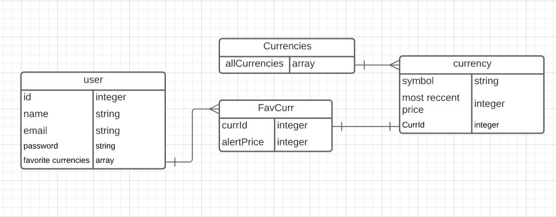
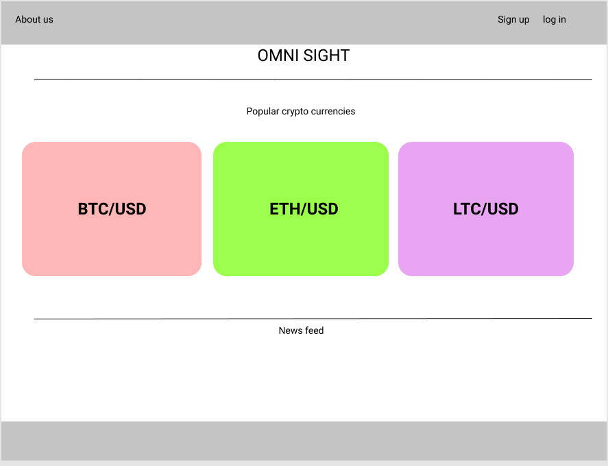
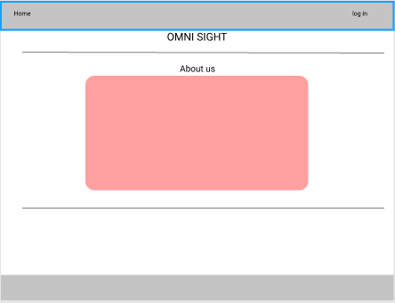
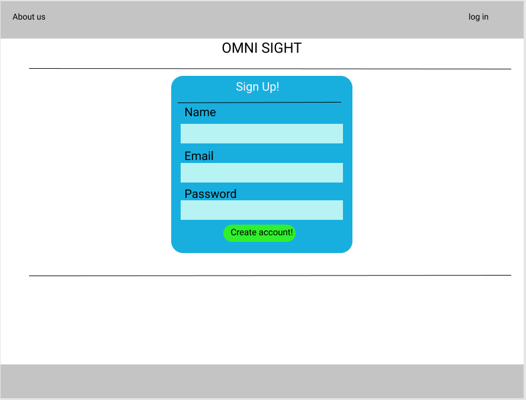
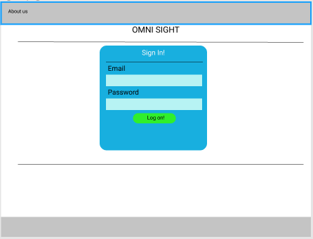
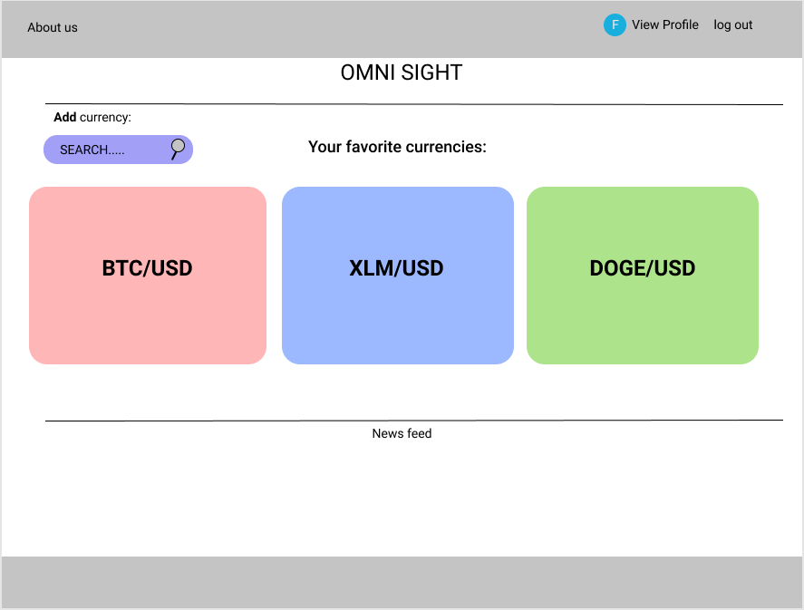
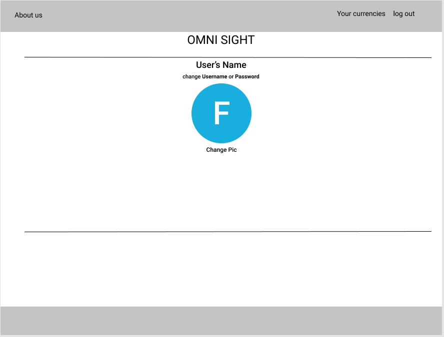

# Omni Sight

## What is Omni Sight?
Omni Sight is for Traders and investors interested in trading crypto-currencies. Omni Sight allows users to add and track their favorite crypto-currencies through an interactive user dashboard. The user dashboard will display your favorite Currencies and allow to you to set custom price alerts and more...

## User Stories

#### As a non-logged-in user
- The user will be able to view popular Crypto-currencies from the home page
- The user will be able to view the most recent prices and news feed for those currencies 
- The user will be able to view log-in, sign-up and about pages

#### As a logged in user
- The user will be able to add and view their favorite crypto-currencies from the user home page
- The user will be able to view the most recent prices and news feed for those currencies
- The user will be able to set price alerts on individual currencies.
- The user will be able to view the about page and their personal profile page
- The user will be able to change their username and profile pic
- When the user logs out the user will be redirected to the home page

## Wireframes

## ERD Diagram

## Overview

### Home page

### About-page

### Sign-up

### Log-in 

### User Dashboard 

### User Profile-page

